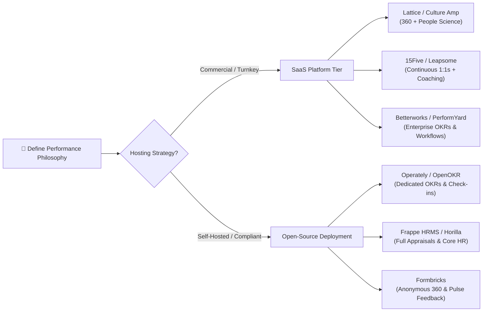

  

  

# 🚀 Awesome Performance Management Platforms Ecosystem

**A Curated Directory of SaaS Solutions & Open-Source Tools for Continuous Performance Management, OKRs, 360 Reviews, Feedback, & People Enablement**

*Empowering People Operations, HR Leaders, People Managers, and Engineering Organizations to cultivate high-performance cultures.*

---

## 📌 Table of Contents

- [Overview](#-overview)
- [Market Landscape & Dynamics](#-market-landscape--dynamics)
- [Top SaaS Performance Management Platforms](#-top-saas-performance-management-platforms)
- [Open-Source GitHub Projects](#-open-source-github-projects)
- [Feature Matrix & Architecture Guide](#-feature-matrix--architecture-guide)
- [How to Contribute](#-how-to-contribute)
- [Star History](#-star-history)
- [Disclaimer](#-disclaimer)

---

## 🔍 Overview

Modern **Performance Management** has shifted rapidly from dreaded, backward-looking annual performance reviews to agile, continuous performance enablement ecosystems. Organizations leverage these modern platforms to power:
- 🎯 **Objective & Key Results (OKRs)** & SMART Goal Cascading
- 🔄 **360-Degree Multi-Rater Feedback** & Peer Reviews
- 💬 **Weekly 1:1 Check-ins**, Agenda Collaborations, & Talking Points
- 📈 **Talent Calibration, 9-Box Grids, & Promotion Readiness**
- 🌟 **Real-time Praise, Recognition, & Engagement Pulses**
- 🧭 **Individual Development Plans (IDPs)**, PIPs, & Succession Planning

---

## 📊 Market Landscape & Dynamics

> **Market Size & Structure:** The global Performance Management Software market is estimated at **$3.5 billion to $4.2 billion** and is projected to expand to over **$8.5 billion by 2030 (CAGR of ~11.5%)**; the broader Employee Experience and HR tech ecosystem represents over $35 billion. The sector is **moderately fragmented**—while category giants like Lattice, Culture Amp, and 15Five capture dominant mindshare and market cap in tech/SMB/mid-market, specialized enterprise solutions (Betterworks, PerformYard, Trakstar, Synergita) and integrated ERP giants (Workday, SAP SuccessFactors) maintain significant customer segments without creating a single winner-take-all monopoly.

---

## 🏢 Top SaaS Performance Management Platforms

The following SaaS platforms lead the industry across performance appraisals, OKR tracking, continuous feedback loops, and people analytics. Products are sorted in **descending order by company scale** (estimated valuation / annual recurring revenue / enterprise market cap).

| Platform | Company Size (Valuation / Revenue) | Starting Price (USD) | Free Tier / Trial Limits | Core Highlights & Capabilities |
| :--- | :--- | :--- | :--- | :--- |
| **[Lattice](https://lattice.com/)** | **$3.0B Valuation** (~$127M+ ARR) | **$8.00** /user/month (billed annually, $4,000 annual minimum) | **Demo-based trial available** (Tailored guided pilot on request; no self-serve free forever tier) | Comprehensive people success platform covering performance reviews, OKRs & goals, continuous 1:1s, engagement surveys, and compensation benchmarking. |
| **[Culture Amp](https://www.cultureamp.com/)** | **$1.5B Valuation** (~$227M+ ARR) | **$11.00** /user/month (billed annually, ~$3,300–$4,500 annual minimum) | **Demo-based enterprise pilot** (Guided sandbox trial during sales onboarding; no perpetual free tier) | Premier employee experience platform combining people science-backed engagement surveys, 360-degree feedback, and turnover predictive analytics. |
| **[Leapsome](https://www.leapsome.com/)** | **$300M Valuation** (~$30.5M ARR) | **$6.00** /user/month (billed annually, $6,000 annual minimum for managed onboarding) | **14-day full-access free trial** (No credit card required; full access to reviews, goals, and surveys) | All-in-one people enablement suite bridging performance management, continuous goals, learning paths, and employee feedback. |
| **[Reflektive](https://www.reflektive.com/)** | **$100M+ Prior Valuation** ($14.2M ARR at LTG acquisition) | **$7.50** /user/month (billed annually) | **Demo upon request** (Custom guided pilot for corporate teams; no open free tier) | Real-time continuous feedback suite and goal tracking integrated directly into Slack, Microsoft Teams, and Outlook. |
| **[15Five](https://www.15five.com/)** | **$90M+ Valuation** (~$30M ARR) | **$4.00** /user/month (Engage plan, billed annually) | **14-day free trial** (Full platform functionality including check-ins, reviews, and High Five social recognition) | Manager-centric continuous performance platform famous for high-impact weekly check-ins, 1:1 meetings, and evidence-based reviews. |
| **[Betterworks](https://www.betterworks.com/)** | **$80M+ Valuation** (~$41.7M ARR) | **$8.00** /user/month (billed annually) | **Interactive guided demo** (Proof-of-concept pilot provided for qualified enterprises; no self-serve free tier) | Enterprise-grade OKR alignment and continuous talent platform focused on strategic alignment, 360 conversations, and executive dashboards. |
| **[PerformYard](https://www.performyard.com/)** | **$75M+ Valuation** (~$15M ARR) | **$5.00** /user/month (billed annually, ranges $5–$7/user based on seat count) | **Live customized trial demo** (Full sandbox trial account configured per company workflow; no permanent free tier) | Highly customizable review cycle workflows, goal tracking, and appraisal forms designed for mid-market and enterprise flexibility. |
| **[Synergita](https://www.synergita.com/)** | **$50M+ Valuation** (~$54M Revenue ecosystem) | **$3.00** /user/month (billed annually; or $4/user monthly) | **Free Forever Plan: Up to 3 users** (Includes 1 company objective, 3 team objectives, 5 individual objectives; paid plans include a **14-day free trial**) | Continuous agile performance appraisals, OKR tracking with AI assistant (OKR Pilot), employee engagement, and sentiment analytics. |
| **[Trakstar](https://www.trakstar.com/)** | **$45M+ Valuation** (~$12M ARR; acquired by Mitratech) | **$4.50** /user/month (billed annually, ~$3,000–$4,000 base annual contract) | **14-day guided trial** (Personal instant test instance provisioned with sample review templates) | Talent development and appraisal engine featuring 360-degree feedback, SMART goal setting, automated email reminders, and competency matrices. |
| **[Engagedly](https://www.engagedly.com/)** | **$40M Valuation** (~$6.9M ARR) | **$2.00** /user/month (billed annually; full platform tiers up to $6–$8/user) | **14-day guided trial** (Available on evaluation request for HR leaders; no perpetual free plan) | Multi-faceted talent platform featuring performance reviews, OKRs, gamified peer recognition, badges, and learning management. |

---

## 💻 Open-Source GitHub Projects

Looking to avoid vendor lock-in, self-host internal employee data, or build a custom performance evaluation workflow? Here are leading open-source repositories and modules for OKR management, employee review cycles, 360 feedback, and HR intelligence.

Repositories are arranged in **descending order by GitHub stargazers**:

| Repository | GitHub_Stars | License | Primary Tech Stack | Description & Performance Scope |
| :--- | :--- | :--- | :--- | :--- |
| **[Odoo](https://github.com/odoo/odoo)** |  | LGPL-3.0 | Python, JavaScript, PostgreSQL | Full-suite enterprise ERP with dedicated **Appraisals and Employee Performance** modules supporting periodic review cycles, 360 feedback surveys, and goal management. |
| **[ERPNext](https://github.com/frappe/erpnext)** |  | GPL-3.0 | Python, JavaScript, MariaDB | Complete open-source enterprise suite featuring structured performance appraisals, goal assignment, employee evaluation criteria, and scorecards. |
| **[Formbricks](https://github.com/formbricks/formbricks)** |  | AGPL-3.0 | TypeScript, Next.js, TailwindCSS | Open-source Qualtrics alternative perfectly suited for running anonymous 360° employee feedback, pulse surveys, manager assessments, and engagement evaluations. |
| **[Frappe HRMS](https://github.com/frappe/hrms)** |  | GPL-3.0 | Python, Vue, JavaScript | Modern, dedicated open-source HR and performance management system covering comprehensive appraisal templates, continuous feedback, goal tracking, and ratings. |
| **[GLPI](https://github.com/glpi-project/glpi)** |  | GPL-3.0 | PHP, JavaScript, MariaDB | Open management infrastructure providing evaluation workflows, team task tracking, compliance audits, and administrative reporting. |
| **[Horilla HRMS](https://github.com/horilla-opensource/horilla)** |  | LGPL-3.0 | Python, Django, JavaScript | Modern, free, and open-source Human Resource Management software with extensible employee performance appraisal, KPI tracking, and check-in workflows. |
| **[OrangeHRM](https://github.com/OrangeHRM/orangehrm)** |  | GPL-2.0 | PHP, Symfony, MySQL | Established open-source HR platform with a robust Performance module providing customizable evaluation cycles, KPI trackers, and 360-degree reviews. |
| **[Operately](https://github.com/operately/operately)** |  | Apache-2.0 | Elixir, Phoenix, React, Tailwind | Open-source company operating system connecting corporate OKRs, weekly check-ins, projects, and cross-team goal progress in real time. |
| **[Thrive Goals](https://github.com/get-thriving/thrive)** |  | MIT | TypeScript, Node.js, React | Modern, minimalist open-source goal and OKR tracking engine for product engineering and cross-functional teams. |
| **[Oslo Kommune OKR Tracker](https://github.com/oslokommune/okr-tracker)** |  | MIT | Vue.js, Firebase, TypeScript | Government and civic-grade open-source web application designed to track Objectives, Key Results (OKRs), and KPIs across teams. |
| **[OpenOKR](https://github.com/OpenOKR/OpenOKR)** |  | Apache-2.0 | Java, Spring Boot, MySQL | Dedicated open-source OKR platform supporting objective cascading, departmental alignment, milestone updates, and goal completion scores. |
| **[HRPulsar](https://github.com/HRPulsar/hrpulsar)** |  | MIT | Python, FastAPI, Next.js | Modern talent and competency management platform supporting 360° assessments, skill frameworks, individual development plans (IDPs), and AI evaluations. |

---

## 🛠️ Feature Matrix & Architecture Guide

When designing an internal performance system or selecting between SaaS and Open-Source solutions:

### Key Selection Criteria
1. **Continuous Check-ins vs. Periodic Reviews:** If your cadence is bi-weekly or monthly, prioritize tools with tight Slack/Microsoft Teams bots (Lattice, 15Five, Operately).
2. **Review Calibration & 9-Box Grids:** Essential for medium-to-large engineering and corporate enterprises to avoid grading bias across managers.
3. **Data Security & Privacy:** Self-hosted open-source options (Frappe HRMS, Horilla, Operately) allow sensitive peer evaluations and performance notes to reside completely within private VPCs.

---

## 🤝 How to Contribute

Contributions are welcome! If you know of an awesome SaaS tool or open-source performance management repository, follow these simple steps:

1. 🍴 **Fork the repository**
2. 🌿 **Create a new branch** (`git checkout -b add-awesome-tool`)
3. ✍️ **Add or update the entry in `README.md`** (Please include specific pricing, free tier/trial details, star counts, and direct links)
4. 💾 **Commit your changes** (`git commit -m 'Add ToolName to Performance Management ecosystem'`)
5. 🚀 **Push to the branch** (`git push origin add-awesome-tool`)
6. 📬 **Open a Pull Request** with a clear explanation

---

## 📈 Star History

---

## ⚖️ Disclaimer

- This repository is a **community-curated index** created for educational, architectural, and evaluation purposes.
- All product names, logos, brands, and registered trademarks belong to their respective owners.
- Performance evaluations and 360 reviews involve sensitive employee data. Ensure compliance with GDPR, SOC 2, HIPAA, and relevant local employment labor regulations when choosing, implementing, or self-hosting performance management software.

---

**[⬆ Back to Top](#-awesome-performance-management-platforms-ecosystem)**

Made with ❤️ for HR leaders, engineering managers, people operations, and high-growth teams.

